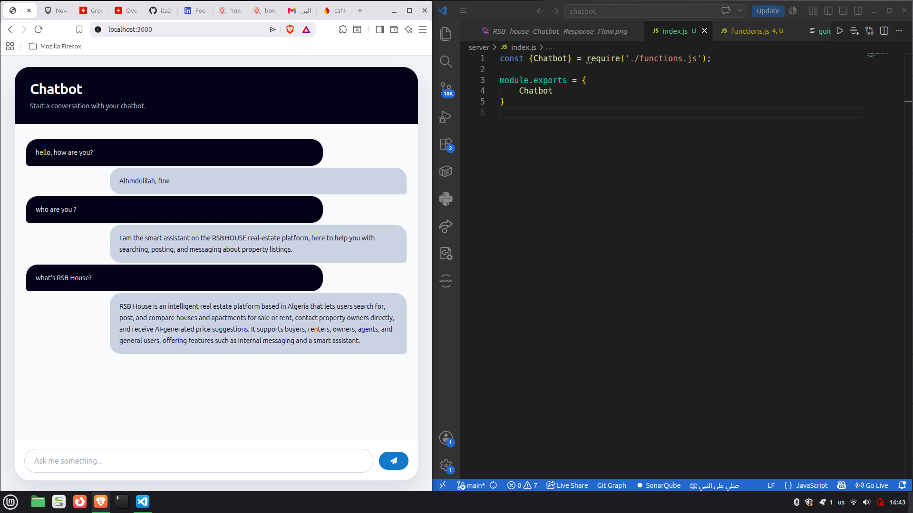
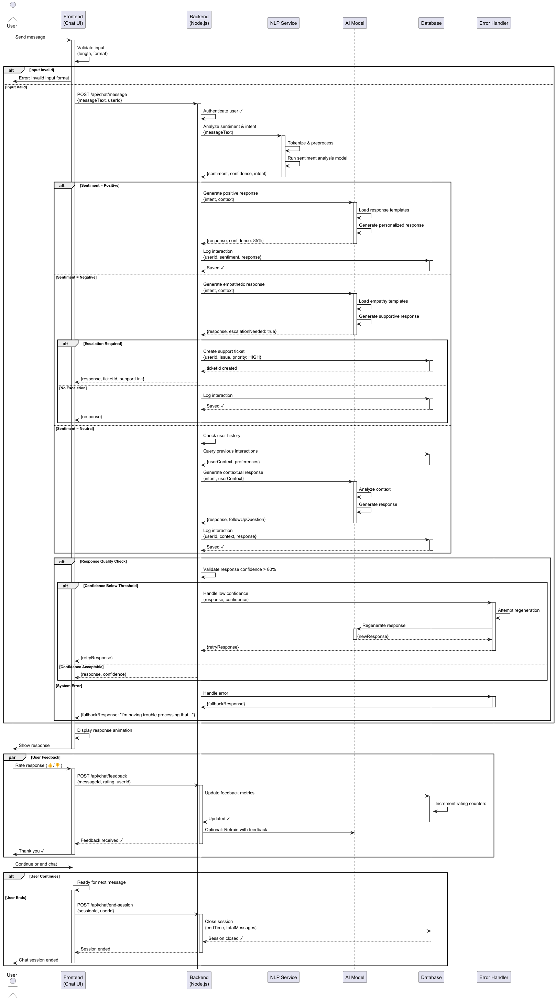

# ChatBot
A customizable AI chatbot that can be seamlessly integrated into any website.

**License:** MIT.

**Created by:** Abderahim (Me)

---
## Built with:
- Node.js
- Firebase with Firestore
> You can use Supabase instead of Firebase (as an SQL database); you will need to modify the CRUD operations in [crud.js](https://github.com/ita27rmp100/Chatbot/blob/main/server/crud.js)
## Basis of this project:
- An information file named **guide.txt**.
- A collection of questions in Firestore named "chatbot_res".
- An LLM (e.g., OpenAI) is used to analyze the *guide.txt* file and the *chatbot_res* collection to extract or generate answers.
---
## Important steps :
- run the following commands :
```terminal
cd server
npm install
touch .env

cd ../demo
npm install
```
- in *server/.env*, you have to provide the following variables:
```
apiKey=
authDomain=
projectId=
storageBucket=
messagingSenderId=
appId=
measurementId=

GROQ_API_KEY=
```
> The first seven vars you will have after creating a new app in the Firebase project; the last one (**GROQ_API_KEY**) is from [groq.com](https://groq.com/)
## Simple Overview:

---
## How it works:

---
## Contributions:
Contributions and suggestions are welcome.
And don't forget to give this repo a **STAR** and thank you <3 .
